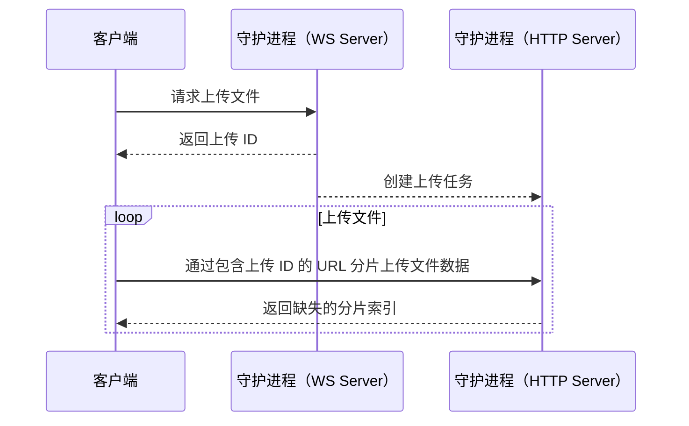
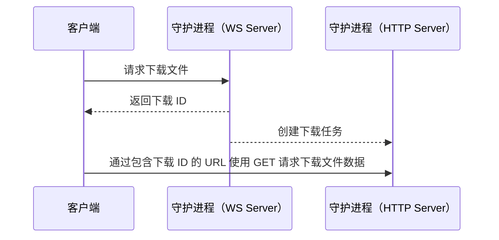

# 文件传输

MCSL Future 通讯协议中，文件上下传采用 **WebSocket** 和 **HTTP** 协议同时使用的方法。

故本文将详细地介绍文件上下传的请求方法。

## 本地文件上传

以下图表展示了本地文件上传的流程：

### <![CDATA[STEP 1 - 请求上传文件]]>

- 客户端向守护进程发送 [`file_upload_request` 操作](actions.md#file_upload_request)，包含文件信息和保存路径等。
- 守护进程返回上传 ID。
- 上传 ID 如果间隔 30s 以上没有被使用（从连接断开到下一次连接），将被自动删除，并取消上传。
- WebSocket 连接断开后，上传 ID 将被自动删除，并取消上传。

### <![CDATA[STEP 2 - 上传文件数据]]>

- 客户端向 `http(s)://<守护进程地址>/upload/<上传 ID>` 发起请求。
    - 请求方法为 **POST**；
    - 请求头包含 `Content-Index`，表示当前分片第一个字节的索引；
    - 请求体直接为文件的数据。
- 守护进程收到请求后，将文件数据保存到文件中，并返回 **200 OK**。
    - 返回包含响应头 `Range`，格式为 `<分片第一个字节索引>-<分片最后一个字节索引>;<开始索引>-<结束索引>;...`，表示缺失的分片索引。
- 客户端根据缺失分片索引，继续发起请求上传分片。客户端根据缺失索引计算上传进度。

### 其他

部分操作（例如通过服务端压缩包新建实例）中，客户端无需请求上传文件
（因为无法提供保存路径），而是调用操作时守护进程会直接返回一个上传 ID。

此上传 ID 不指向到任何实例中的路径，而是指向到守护进程中的临时文件，可通过此上传 ID 获取上传进度。

上传完成后，守护进程将通过上传的文件完成操作。

## 文件下载

以下图表展示了文件下载的流程：

### <![CDATA[STEP 1 - 请求下载文件]]>

- 客户端向守护进程发送 [`file_download_request` 操作](actions.md#file_download_request)，包含文件路径等。
- 守护进程返回下载 ID。
- 下载 ID 如果在 30s 内没有被使用（从连接断开到下一次连接），将被自动删除。
- WebSocket 连接断开后，下载 ID 将被自动删除。

### <![CDATA[STEP 2 - 下载文件数据]]>

#### 全部下载

- 客户端向 `http(s)://<守护进程地址>/download/<下载 ID>` 发起 **GET** 请求，即可下载文件数据。
- 守护进程收到请求后，将文件数据返回给客户端，响应为 **200 OK**。

#### 分片下载

- 客户端向 `http(s)://<守护进程地址>/download/<下载 ID>` 发起 **HEAD** 请求。
- 守护进程返回数据，响应为 **200 OK**，客户端可通过 `Content-Length` 标头获取文件大小。
- 客户端向 `http(s)://<守护进程地址>/download/<下载 ID>` 发起 **GET** 请求，包含 `Range` 标头，即可下载文件数据的指定分片。
- 守护进程收到请求后，将文件数据返回给客户端，响应为 **206 Partial Content**。
