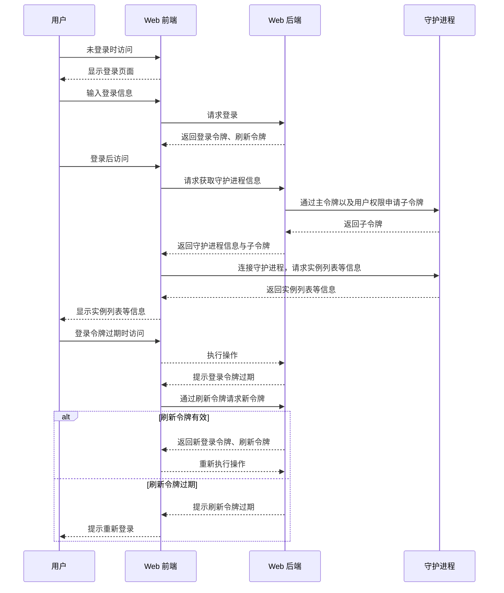

# MCSL Future Web 的用户系统

在 MCSL Future Web 中，有一套用户系统，用于管理用户权限。

## 用户模型

用户模型包含以下字段：

|     字段      |          数据类型          |             说明             |
|:-----------:|:----------------------:|:--------------------------:|
|     id      | [uuid](models.md#uuid) |       用户 ID，唯一标识一个用户       |
|    name     |          str           |         用户名称，用于显示          |
|  password   |          str           | 用户密码，用于登录，使用 SHA-256 哈希值存储 |
| permissions |          list          |   用户权限，用于申请子令牌和使用 Web 功能   |

## 用户鉴权

在初次运行 MCSL Future Web 时，系统将开放权限，允许直接注册一个管理员账户。

此后可以通过管理员账户登录 MCSL Future Web。

以下图表展示了用户使用 MCSL Future Web 的流程：

## 用户管理

WIP